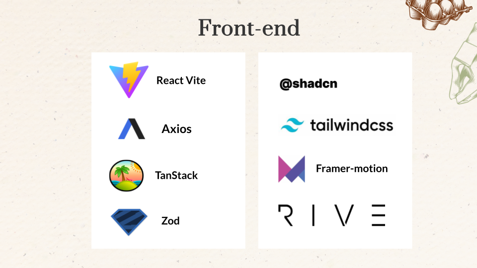
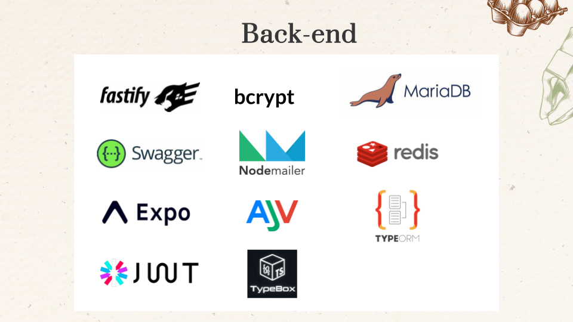
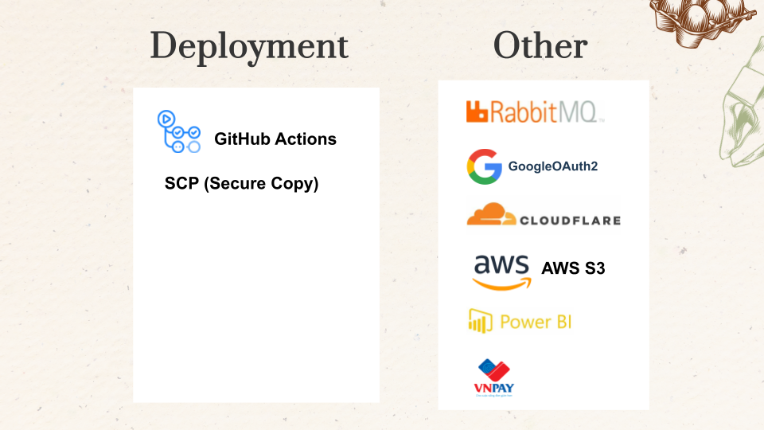
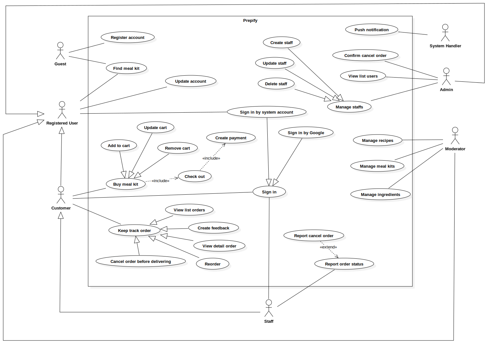
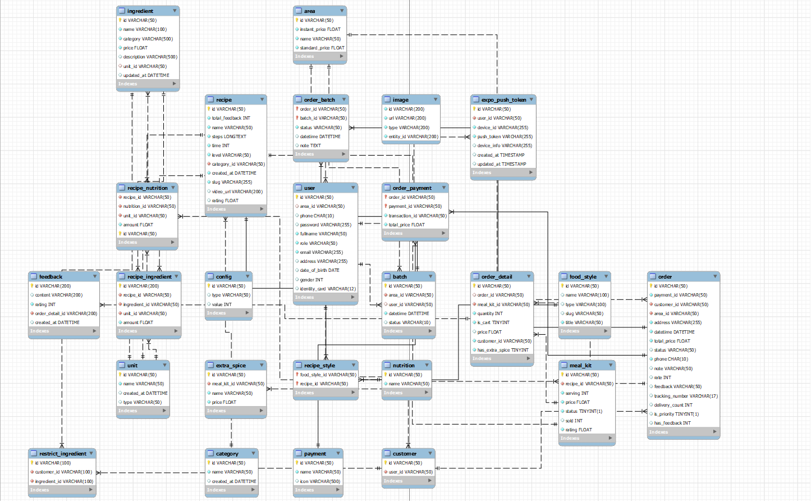

# Prepify - Convenient Nutrition for Busy Lives

<div align="center">
    
    <p><a href="https://prepify.namdh03.site">Prepify</a> is a web application that offers convenient pre-prepared meal kits for busy individuals.</p>
</div>

## 1. Introduction

Prepify is an online shopping app designed to provide convenience, easy price comparison, numerous promotions, cashless payments, home delivery, and order management. It aims to address the challenges faced by busy office workers and students, as well as issues associated with traditional market shopping.

**Key Features:**

- **Admins:** Manage shipper accounts and access rights.
- **Moderators:** Manage ingredient packages, recipes, and orders.
- **Customers:** Purchase meal kits, track orders, and manage dietary restrictions.
- **Shippers:** Handle order deliveries and update order statuses.

## 2. Tech Stacks

### 2.1 - Front End



### 2.2 - Back End



### 2.3 - Dev Ops



### 2.4 - Mobile


## 3. Installation

Clone the repository:

```bash
git clone https://github.com/namdh03/prepify-frontend
```

Navigate to the folder:

```bash
cd prepify-frontend
```

Install the dependencies:

```bash
npm install
```

Set the environment variables:

```bash
cp .env

# Open .env.development and modify the environment variables
```

## 4. Environment Variables

```bash
VITE_API_URL=https://prepify-api.namdh03.site
```

## 5. Use Case Diagram



## 6. Database Design



## 7. Team Members

- [Lam Thi Ngoc Han](https://github.com/LamHana): Project Leader, Front-end Developer, UI/UX Designer
- [Duong Hoang Nam](https://github.com/namdh03): Front-end Leader, Mobile Developer
- [Tran Tan Thanh](https://github.com/ttthanhf): Back-end Leader
- [Van Phu Hoa](https://github.com/vphoa342): Back-end Developer, Mobile Developer

## 8. Testing Accounts

### 8.1 - Admin

```bash
  email: admin@prepify.com
  password: Password123@
```

### 8.2 - Moderator

```bash
  email: moderator@prepify.com
  password: Password123@
```

### 8.3 - Customer

```bash
  email: customer@prepify.com
  password: Password123@
```

### 8.4 - Shipper (Repository: [prepify-mobile](https://github.com/vphoa342/prepify-mobile))

```bash
  email: shipper@prepify.com
  password: Password123@
```

## 9. Business Rules

- **BR-001:** Access restriction based on user role and device.
- **BR-002:** The shipper's working hours are from 7:00 am - 7:00 pm.
- **BR-003:** Automatically log out users after 15 minutes of inactivity.
- **BR-004:** Users must log in using their phone and password.
- **BR-005:** The name length limit must be in the range of 1 – 50 characters.
- **BR-006:** Phone number and email must be unique.
- **BR-007:** Email addresses must follow a standard email format.
- **BR-008:** Phone number must be 10 digits.
- **BR-009:** Password must be 8 or more characters, and contain at least a number and special character.
- **BR-010:** User can only update their profile.
- **BR-011:** Users can reset their password using a registered email address.
- **BR-012:** Users can deactivate their accounts at any time.
- **BR-013:** Customers only can cancel orders before they change to “to ship” status.
- **BR-014:** Customers are not refunded after cancelling the order.
- **BR-015:** A customer must have a valid shipping address to proceed to payment.
- **BR-016:** Any change in ingredient pricing must be updated immediately and displayed clearly.
- **BR-017:** Orders must be placed through the shopping cart and checkout process.
- **BR-018:** The only accepted payment method is VNPAY.
- **BR-019:** Users can track their orders via a tracking number provided after dispatch.
- **BR-020:** Users receive an email notification once the order has been delivered.
- **BR-021:** An order was delivered twice before being cancelled.
- **BR-022:** User data must be encrypted during transmission and storage.
- **BR-023:** Verify that users meet any age restrictions for purchasing certain products.
- **BR-024:** Allow verified buyers to leave reviews and ratings for products.
- **BR-025:** Allow users to review their order details before finalizing the purchase.
- **BR-026:** Allow users to save items in their cart for future purchases.
- **BR-027:** Allow users to customize certain meal kits according to their preferences.
- **BR-028:** The shipper must deliver the order within 48 hours after the customer pays.
- **BR-029:** Allow customers to change their address when creating a new order.
- **BR-030:** Each shipper is assigned one specific area.
- **BR-031:** An order must include a delivery address that can be mapped to one of the Ho Chi Minh districts.
- **BR-032:** Shippers are restricted to delivering orders only within their designated geographical area.
- **BR-033:** Customers must declare any restricted ingredients (allergies, dietary restrictions, or personal preferences) during account registration or profile update.
- **BR-034:** The system must automatically check all ingredients in a selected recipe against the customer’s restricted ingredients list before the order is finalized.
- **BR-035:** Notify customers if any of their restricted ingredients are included in an order they are trying to place.
- **BR-036:** All ingredients and meal kits must be accurately labelled with all contents, including potential allergens.
- **BR-037:** The cost of a meal kit must be calculated based on the sum of the costs of all individual ingredients.
- **BR-038:** A fixed or percentage-based service fee must be added to the total ingredient cost to determine the final meal kit price.
- **BR-039:** The shipper must provide evidence as a photo after successful delivery.
- **BR-040:** Shippers can only delay orders when certain conditions are met (e.g., unable to reach the customer after 3 calls).

## 10. Repositories and Deployment

- **Front-end Repository:** [Prepify Frontend](https://github.com/namdh03/prepify-frontend)
- **Back-end Repository:** [Prepify Backend](https://github.com/ttthanhf/prepify-backend)
- **Mobile Repository:** [Prepify Mobile](https://github.com/vphoa342/prepify-mobile)
- **Front-end Deployment:** [Prepify Frontend Deployment](https://prepify.namdh03.site/)
- **Swagger UI (Backend API):** [Prepify Swagger UI](https://prepifyb.thanhf.dev/docs/static/index.html)

## 11. Mobile Screen List

| ID   | Screen Name              | Description                                                                                   |
|------|--------------------------|-----------------------------------------------------------------------------------------------|
| SC-01| Login screen             | Shippers log in using their credentials with options for password recovery and account creation.|
| SC-02| View the new order screen| Lists new shipping orders with details for shippers to start delivery.                         |
| SC-03| Route screen             | Displays the optimal route with navigation, ETA, and traffic updates.                          |
| SC-04| Delivering screen        | Real-time updates on the current delivery with options to confirm pickup, update status, and contact recipients.|
| SC-05| Completed screen         | Lists all completed deliveries with details and recipient feedback.                            |
| SC-06| Delay screen             | Manages and reports delivery delays with reasons and updated ETAs.                             |
| SC-07| Cancel screen            | Allows order cancellations with reasons and communication to inform parties involved.          |
| SC-08| Profile screen           | Displays and allows updates to the shipper's personal info and app settings.                   |